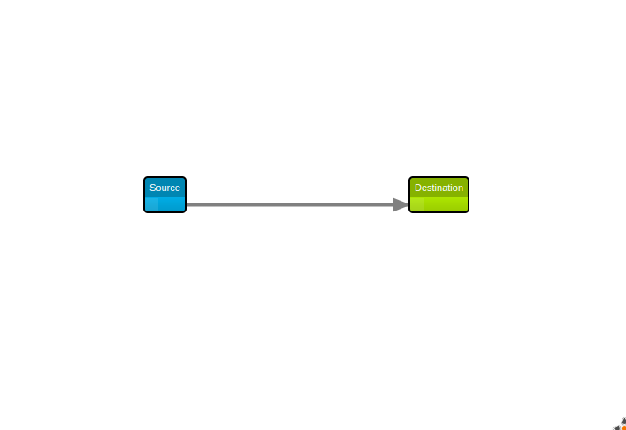

# Introduction

A small project made with the help of [React-diagrams](https://github.com/projectstorm/react-diagrams).

A tool to make flows and diagrams.



### Features

- Drag and drop the whole frames
- Place the nodes anywhere
- Logs the changes

## How to run

```
git clone https://github.com/ayushjaipuriyar/app-ui
cd app-ui/app-ui/
npm install
npm start
```

### Additional information
Operating System used : Linux\
Javascript version : ES6\
create-react-app version: 4.03\
npm version: 8.0.0
